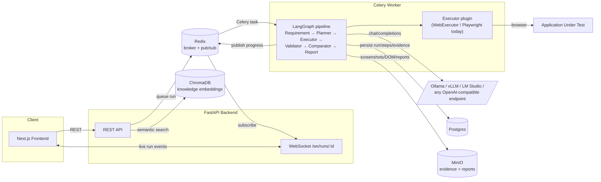

# Stryker

**Stryker — The Autonomous AI QA Engineer.**

Stryker takes a plain-English requirement ("Verify Admin can create an invoice and the customer balance updates") and turns it into a full test run: an AI-generated plan, a real browser execution against your app, a business-outcome validation, evidence capture, and a report — with no test script written by a human.

## What it is

- An AI QA engineer, not a recorder. You describe *behavior*, not steps. Stryker's RequirementAgent infers the validations, risks, and edge cases a human QA engineer would ask about even when you didn't spell them out.
- Self-healing by construction. Plans never reference CSS selectors or XPath — the planner describes elements the way a person would ("the Create Invoice button"), and a locator cascade resolves that description at run time, tolerating renames and layout changes.
- Outcome-driven validation. A step "passing" (a click didn't error) is not the same as a requirement being satisfied. Stryker's ValidatorAgent judges business outcomes from what was actually observed on the page/API, not from mechanical step success.
- Evidence-first. Every step captures a screenshot, DOM snapshot, accessibility tree, console log, network log, and timing — regardless of pass/fail — so a "self-healed" pass can be audited, not just trusted.
- Self-hosted and provider-agnostic for reasoning. Point it at Ollama, vLLM, LM Studio, or any OpenAI-compatible endpoint. No hosted-LLM dependency required to run the whole platform end-to-end.

## What it isn't

- **Not a Playwright wrapper.** Playwright is how the web Executor happens to drive a browser today, but the planner and validator never see or emit Playwright code, selectors, or Page Object patterns. The `Executor` plugin interface is the actual product surface — Playwright is one implementation of it.
- **Not a chatbot that writes test scripts for you to run.** Stryker plans, executes, validates, and reports in one pipeline; there's no intermediate "here's your test code" hand-off step. (There *is* a project-scoped AI chat for asking questions about past runs and your knowledge base — see below — but that's a QA-history assistant, not the execution engine.)

## The core loop

```
Project → Knowledge → Credentials → Requirement → AI Plan → Execute → Validate → Evidence → Report
```

1. **Project** — register the application under test: platform, base URL, environment.
2. **Knowledge** — upload documentation (Markdown, PDF, DOCX, TXT, CSV, images via OCR, OpenAPI/Swagger specs, Postman collections, SQL) so the AI pipeline has domain context beyond the requirement text itself.
3. **Credentials** — store per-role login profiles (username/password, API/bearer tokens, cookies, headers), encrypted at rest.
4. **Requirement** — write what should be true in plain English.
5. **AI plan** — a LangGraph pipeline (RequirementAgent → PlannerAgent) turns that into an ordered, platform-agnostic execution plan.
6. **Execute** — a registered Executor (Playwright-based `WebExecutor` today) runs the plan against a real browser, self-healing element locators as it goes.
7. **Validate** — the ValidatorAgent judges each expected outcome against what was actually observed — met, not met, or inconclusive.
8. **Evidence** — every step's screenshot, DOM, accessibility tree, console/network logs, and timing land in MinIO, linked to the step.
9. **Report** — a Markdown + JSON report is generated automatically when the run finishes; PDF and Jira-markup renderings are generated on demand from the same data.

Progress streams live to the frontend over a WebSocket (backed by Redis pub/sub), and a per-project AI chat lets you ask questions like "why did the invoice flow fail last week?" grounded in your knowledge base and run history.

## Architecture at a glance



See [`docs/ARCHITECTURE.md`](docs/ARCHITECTURE.md) for the full service topology (including OpenSearch, OTel, Prometheus, Grafana) and the LangGraph state machine.

## Quick start

```bash
# 1. Configure environment
cp .env.example .env

# Generate the two required secrets and paste them into .env:
python -c "import secrets; print(secrets.token_urlsafe(48))"                      # JWT_SECRET
python -c "from cryptography.fernet import Fernet; print(Fernet.generate_key().decode())"  # CREDENTIAL_ENCRYPTION_KEY

# 2. Bring the stack up (CPU profile — see docs/DEPLOYMENT.md for GPU)
docker compose --profile cpu up --build

# 3. Pull a local model for the Ollama container
make seed-model   # docker compose exec ollama-cpu ollama pull llama3.1

# 4. Open the app
open http://localhost:3000
```

The backend applies Alembic migrations automatically on container start (`alembic upgrade head`). The first user to register through the app becomes the `owner`.

## Supported LLM providers

Stryker never talks to a proprietary LLM SDK directly — every provider that matters for a self-hosted deployment speaks the same OpenAI-compatible `/v1/chat/completions` wire protocol, so one client class (`app/llm/providers/openai_compatible.py`) serves all of them:

| `LLM_PROVIDER` | Typical `LLM_BASE_URL` | Notes |
|---|---|---|
| `ollama` (default) | `http://ollama:11434/v1` | Local, no API key needed |
| `vllm` | `http://<host>:8000/v1` | Self-hosted, GPU-backed |
| `lmstudio` | `http://<host>:1234/v1` | Local desktop server |
| `openai_compatible` | any endpoint implementing the OpenAI chat-completions API | Set `LLM_API_KEY` if the endpoint requires one |

Configure via `LLM_PROVIDER`, `LLM_BASE_URL`, `LLM_MODEL`, `LLM_API_KEY` — a config change, never a code change. See [`app/core/config.py`](backend/app/core/config.py) and [`docs/DEPLOYMENT.md`](docs/DEPLOYMENT.md).

## Current scope vs. roadmap

Phase 1 (implemented today) covers the **web platform end-to-end**. See [`docs/ARCHITECTURE.md`](docs/ARCHITECTURE.md) for the honest breakdown, but in short:

**Implemented:**
- Web execution via Playwright, with a 6-strategy self-healing locator cascade (test-id → ARIA role/name → exact text → label/placeholder → fuzzy string match → LLM semantic disambiguation over the accessibility tree)
- Knowledge ingestion for Markdown/PDF/DOCX/TXT/CSV/images (OCR)/OpenAPI/Swagger/Postman/SQL, embedded into ChromaDB
- Encrypted credential profiles (Fernet, AES-128-CBC + HMAC)
- The full RequirementAgent → PlannerAgent → Executor → ValidatorAgent → ComparatorAgent → ReportAgent LangGraph pipeline, with a bounded replan loop on execution errors
- Evidence capture (screenshot, DOM, accessibility tree, console, network, timing) in MinIO
- Markdown + JSON reports auto-generated at run completion; PDF and Jira-markup on demand
- Live run streaming via Redis pub/sub + a FastAPI WebSocket
- A per-project AI chat grounded in knowledge base + run history

**Not yet implemented (roadmap):**
- REST API, GraphQL, mobile, and desktop `Executor` plugins — only the plugin interface exists (`app/agents/executors/base.py`) so these can be added without touching the planner/validator/execution engine
- True vision-model grounding — the "reasoning fallback" in the locator engine is **LLM text-based semantic disambiguation over the accessibility tree** (role + accessible-name pairs), not a vision model looking at a screenshot
- MFA/OTP/OAuth login flows on credential profiles — `CredentialProfile.auth_metadata` is a schema placeholder only
- OpenSearch indexing — the service is provisioned in `docker-compose.yml` but nothing writes to it yet in phase 1
- Kubernetes manifests for production deployment

## Documentation

- [`docs/ARCHITECTURE.md`](docs/ARCHITECTURE.md) — service topology, the LangGraph state machine, the Executor plugin interface, the locator cascade, security model
- [`docs/DEPLOYMENT.md`](docs/DEPLOYMENT.md) — Docker Compose, environment variables, migrations, external LLM providers, production considerations
- [`docs/CONTRIBUTING.md`](docs/CONTRIBUTING.md) — running tests, linting, adding a parser, PR conventions
- [`docs/PLUGIN_GUIDE.md`](docs/PLUGIN_GUIDE.md) — worked examples for adding an Executor, a knowledge parser, or an LLM provider
- [`docs/API.md`](docs/API.md) — REST endpoint and WebSocket reference

## License

Apache License 2.0 — see [`LICENSE`](LICENSE).

## Contributing

Contributions are welcome. Start with [`docs/CONTRIBUTING.md`](docs/CONTRIBUTING.md) for the dev workflow, test/lint commands, and how to add a new knowledge-source parser, Executor, or LLM provider.
