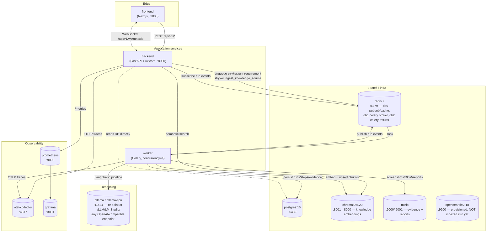
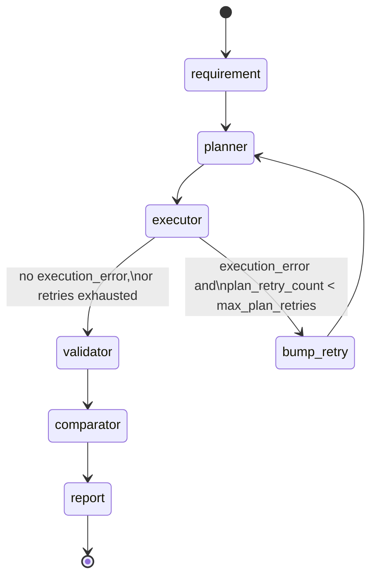
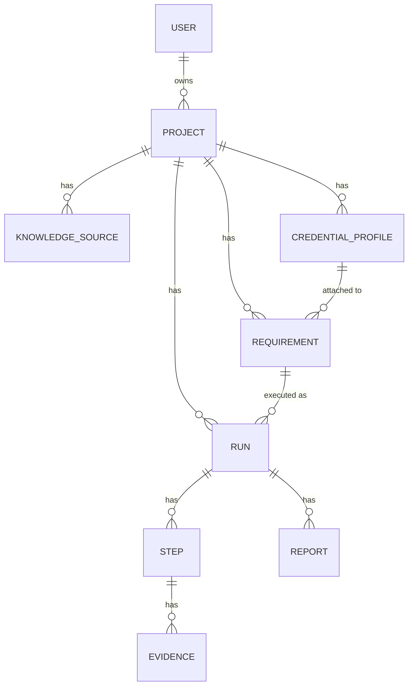

# Architecture

This document describes what is actually implemented in `backend/app` today, not the aspirational full product. Where something in the original PRD isn't built yet, it's called out explicitly rather than described as if it worked.

> **Frontend note:** the frontend (`frontend/`) is being built concurrently with this documentation and its directory structure may differ in fine detail from what's described here by the time you read this. The contract it talks to — the REST API and the `/ws/runs/{run_id}` WebSocket — is documented precisely in [`API.md`](API.md) and is the stable surface.

## Service topology

Stryker is a Docker Compose stack of infrastructure services, a FastAPI backend, a Celery worker, and a Next.js frontend. The backend process and the worker process run the *same application code* (`app/`) — the only difference is which entrypoint (`uvicorn` vs. `celery worker`) drives it — so agent/executor/RAG code never has to know which process it's running in.



Service details (see `docker-compose.yml`):

| Service | Image | Role |
|---|---|---|
| `postgres` | `postgres:16-alpine` | System of record: projects, requirements, runs, steps, evidence metadata, users, credential profiles (encrypted) |
| `redis` | `redis:7-alpine` | Three roles on one instance: Celery broker (db1), Celery result backend (db2), and the pub/sub bus (db0) that bridges worker → WebSocket |
| `chroma` | `chromadb/chroma:0.5.20` | One collection per project (`{prefix}_{project_id.hex}`) for knowledge-base embeddings |
| `minio` | `minio/minio` | S3-compatible object storage for raw knowledge uploads, evidence artifacts (screenshots, DOM snapshots), and rendered reports |
| `opensearch` | `opensearchproject/opensearch:2.18` | **Provisioned but unused in phase 1** — see [Known gaps](#known-gaps-and-roadmap) |
| `ollama` / `ollama-cpu` | `ollama/ollama` | Default local LLM runtime; `ollama` (GPU) and `ollama-cpu` (CPU) are mutually exclusive Compose profiles (`gpu` / `cpu`) |
| `otel-collector` | `otel/opentelemetry-collector-contrib` | Receives OTLP traces from `backend`/`worker`, exports to Prometheus + debug log |
| `prometheus` | `prom/prometheus` | Scrapes `backend:8000/metrics` (via `prometheus-fastapi-instrumentator`) |
| `grafana` | `grafana/grafana` | Dashboards over the Prometheus datasource, anonymous access enabled for local dev |
| `backend` | built from `backend/Dockerfile` | FastAPI app (`app.main:app`); runs `alembic upgrade head` before `uvicorn` starts |
| `worker` | built from `backend/Dockerfile.worker` | Celery worker (`app.execution.celery_app`), same codebase, Playwright + Tesseract installed for execution and OCR ingestion |
| `frontend` | built from `frontend/Dockerfile` | Next.js app, talks to `backend` via `NEXT_PUBLIC_API_URL` / `NEXT_PUBLIC_WS_URL` |

## The LangGraph run pipeline

Every Run is one execution of `build_run_graph` (`app/agents/graph.py`) — a compiled LangGraph `StateGraph` over a single `RunState` TypedDict (`app/agents/state.py`) threaded through every node. Using a flat dict rather than passing ORM objects around is deliberate: each agent function takes `(state: RunState, llm: LLMProvider) -> RunState` and can be unit-tested with a plain dict, no DB or LLM required for the deterministic pieces (see `ComparatorAgent._compute_confidence` below).



Node by node:

1. **`requirement` — `RequirementAgent`** (`app/agents/requirement_agent.py`). Takes the raw requirement text plus RAG context (`knowledge_context`, populated in `app/execution/tasks.py` via `context_snippets_for_requirement`) and produces a structured understanding: `understood_intent`, `expected_outcomes`, `inferred_validations` (checks the requirement implies but never stated — audit logs, balance updates, permission boundaries), `identified_risks`, `predicted_edge_cases`, and a `requirement_confidence`. This is the step that makes Stryker behave like a QA engineer rather than a script recorder.
2. **`planner` — `PlannerAgent`** (`app/agents/planner_agent.py`). Turns that understanding into an ordered list of `PlannedStep`s. Steps are platform-agnostic in *shape* (`action_type` + `parameters`) and, critically, **never contain a CSS/XPath selector** — UI targets are described the way a human tester would ("the Create Invoice button"). The system prompt tells the model exactly which `action_type`s exist (`navigate`, `login`, `click`, `fill`, `select`, `check`, `uncheck`, `hover`, `wait`, `assert_text`, `assert_business_outcome`, `api_call`) and how to shape `parameters` for each.
3. **`executor` — `run_executor_node`** (`app/agents/executor_node.py`). Looks up the registered `Executor` for `state["platform"]` and drives it through every step in the plan, emitting a `RunStepEvent`-shaped dict via `on_event` before and after each step (this is what reaches the WebSocket). A failed `login` or `navigate` step aborts the remaining plan early — every later step would be meaningless without a valid session or page — and sets `execution_error`.
4. **Conditional edge — `should_replan`.** If `execution_error` is set and `plan_retry_count < settings.max_plan_retries` (default 2), control returns to `planner` via the `bump_retry` node instead of retrying the same broken plan. This is deliberately different from per-step retries, which happen inside the Executor itself (e.g. the locator cascade retrying strategies) — a replan is for "the whole approach was wrong" (bad login step, wrong navigation path), not "one selector didn't resolve."
5. **`validator` — `ValidatorAgent`** (`app/agents/validator_agent.py`). For every `expected_outcome` and `inferred_validation` from step 1, judges `met` / `not_met` / `inconclusive` against what the executor actually observed (DOM text, API bodies, error messages) — never against whether a step merely executed without throwing. "The button was clicked" is not evidence of anything; "the invoice appeared in the grid" is.
6. **`comparator` — `ComparatorAgent`** (`app/agents/comparator_agent.py`). See [confidence scoring](#why-confidence-is-deterministic) below.
7. **`report` — `ReportAgent`** (`app/agents/report_agent.py`). Writes the PM-facing Markdown narrative (Executive Summary → Requirement → Timeline → Findings → Root Cause → Recommendation) via one LLM call. The JSON report is a pure restructuring of the same `RunState` fields — no second LLM call.

The graph is compiled once per run inside the Celery task (`app/execution/tasks.py::_run_requirement_async`) with a fresh `on_event` closure that publishes to Redis (`publish_sync`), and invoked with `graph.ainvoke(initial_state, config={"recursion_limit": 50})`. A crash anywhere in the graph is caught at that call site and persisted as an `errored` run rather than propagating — a run always ends in a terminal DB state.

## The Executor plugin interface

The seam that makes "add a new platform later" possible without touching the planner, validator, or graph is `app/agents/executors/base.py`:

```python
class Executor(ABC):
    platform: str

    def __init__(self, base_url, credential, on_event, llm): ...

    @abstractmethod
    async def setup(self) -> None: ...

    @abstractmethod
    async def execute_step(self, step: PlannedStep) -> ExecutedStepResult: ...

    @abstractmethod
    async def teardown(self) -> None: ...
```

`register_executor(platform, cls)` populates a module-level registry; `get_executor_class(platform)` looks it up. `app/agents/executors/__init__.py` imports every built-in executor and registers it at import time — today that's exactly one: `WebExecutor` registered under `"web"`. `app/main.py` imports `app.agents.executors` (and `app.rag.parsers`) purely for this side effect, so the registries are populated before the first request.

Every `Executor` — not just the web one — receives an `LLMProvider`, not only a platform-specific client. That's intentional: self-healing and semantic disambiguation are cross-platform concerns (a renamed button breaks a web locator the same way a renamed control breaks a desktop accessibility API), so the *reasoning* fallback is expected to live inside each platform's own locator/resolution logic, but every executor is handed the same model access point rather than reinventing LLM plumbing per platform.

**`WebExecutor`** (`app/agents/executors/web/playwright_executor.py`) is the reference implementation:
- `setup()` acquires a `BrowserContext` from the shared `BrowserPool` (see below), opens a page, wires console/network buffers, and replays any saved cookies from the attached credential.
- `execute_step()` dispatches on `action_type`, always captures the full evidence set (screenshot, DOM, accessibility tree, console tail, network tail, timing) regardless of pass/fail — evidence-on-failure-only would hide near-misses — and returns an `ExecutedStepResult`.
- `teardown()` closes the page and context and returns the underlying `Browser` to the pool; it must never raise.
- Element resolution never touches Playwright selectors directly from the plan — it goes through `SelfHealingLocator` (see next section).

Adding a new platform (REST API, GraphQL, a native mobile driver) means writing one class that implements these three methods and calling `register_executor("your_platform", YourExecutor)` — see [`PLUGIN_GUIDE.md`](PLUGIN_GUIDE.md) for a full worked example. **REST API, GraphQL, mobile, and desktop executors are not implemented today** — only this interface and the web reference implementation exist.

## The self-healing locator cascade

`app/agents/executors/web/locator_engine.py::SelfHealingLocator` is why plans can describe "the Create Invoice button" instead of a selector. The `PlannerAgent` emits a `Target` (description, optional ARIA role hint, optional text hint, optional test-id hint); `locate()` tries strategies in order and stops at the first one that resolves to exactly one visible element:

1. **Explicit test id** — `data-testid` / `data-test` / `data-qa`, tried against several casing/slug variants of the hint.
2. **ARIA role + accessible name** (`get_by_role(role, name=...)`, fuzzy substring match on name).
3. **Exact visible text** — `get_by_text`.
4. **Label or placeholder text** — `get_by_label`, falling back to `get_by_placeholder`.
5. **Fuzzy accessible-name match** — walks the live accessibility tree for interactive elements (`button`, `link`, `textbox`, `checkbox`, `radio`, `combobox`, `menuitem`), then uses `difflib.get_close_matches` against their accessible names. Handles renames and typos that beat strategies 1–4.
6. **LLM semantic disambiguation** — the last resort. The same interactive-element list (role + name pairs only, indexed) is sent to the configured LLM with a strict JSON schema (`{"index": int, "confidence": float}`), asking it to pick the best match for the target description, accounting for renames, synonyms, and full redesigns. A `confidence < 0.5` or `index == -1` is treated as "no match."

**Every attempt is recorded** (`LocateResult.attempts`) regardless of which strategy ultimately succeeds, so a step's evidence shows exactly what was tried — the point being that a QA engineer reviewing a "self-healed" pass can see *how* healed it was, rather than trusting an opaque green checkmark.

> **Honesty note on "reasoning":** strategy 6 is **LLM text-based semantic reasoning over the accessibility tree** (role/name pairs as JSON), not a vision model looking at a rendered screenshot. The original product brief used the phrase "vision reasoning fallback" for this cascade step; that phrasing oversells what's implemented. True vision-model grounding (an actual image passed to a multimodal model) is not implemented and is a roadmap item, not a "future version of the same thing that already partially works."

## Why confidence scoring is deterministic

`ComparatorAgent._compute_confidence` (`app/agents/comparator_agent.py`) is a pure function of `RunState` — no LLM call:

```python
score = round((0.5 * outcome_ratio + 0.3 * avg_finding_confidence + 0.2 * step_pass_ratio), 4)
```

- `outcome_ratio` — fraction of `ValidatorAgent` findings marked `met`.
- `avg_finding_confidence` — the mean of each finding's own LLM-assigned confidence.
- `step_pass_ratio` — fraction of executor steps that didn't fail mechanically.

`final_status` is `passed` only if the score clears `0.6` **and** there are no `not_met` findings and no failed steps — a high blended score can't paper over a single explicit failure. An `execution_error` or an empty findings list short-circuits to `(0.0, "errored")` before any weighting happens.

This is deliberately *not* delegated to the LLM: a confidence number that comes out of arithmetic over already-LLM-judged findings is reproducible (the same findings always produce the same score), auditable (you can show a PM exactly which three numbers produced 0.73), and immune to the LLM "helpfully" second-guessing itself on a re-run. What genuinely benefits from LLM judgment — *why* something failed, in language a developer can act on — is generated separately, once, only when `final_status` is `failed`/`errored`, via `ROOT_CAUSE_SYSTEM_PROMPT`. Splitting the two means a flaky LLM root-cause narrative never destabilizes the number a dashboard sorts runs by.

## Browser pool

`app/execution/browser_pool.py::BrowserPool` keeps `BROWSER_POOL_SIZE` (default 4) Chromium processes warm at all times, started once at FastAPI startup (`app.main::lifespan`) and stopped at shutdown. Cold-launching a browser process costs seconds; creating a new isolated `BrowserContext` from an already-running `Browser` costs tens of milliseconds. `acquire_context()` is an async context manager: it borrows a `Browser` from the pool's queue, yields a fresh `BrowserContext`, and always closes the context and returns the `Browser` to the queue on exit — contexts are never reused across runs, but processes are.

## Knowledge / RAG pipeline

Upload → parse → chunk → embed → store, run as a Celery task (`ingest_knowledge_source_task`) so the upload endpoint returns immediately and indexing happens in the background:

1. **Parse** — `app/rag/parsers/base.py` is a registry (`register_parser(KnowledgeSourceType, fn)`) exactly like the Executor registry. `app/rag/parsers/__init__.py` registers the built-ins: `parse_markdown`/`parse_txt` (also reused for `SQL`), `parse_pdf` (`pypdf`, one block per page), `parse_docx` (`python-docx`, paragraphs + flattened tables), `parse_csv` (`pandas`, one block per row plus a column-header block), `parse_image` (`pytesseract` OCR, also reused for `SCREENSHOT`), and `parse_openapi`/`parse_postman_collection` (`app/rag/parsers/api_spec.py`, reused for both `SWAGGER` and `OPENAPI` — each API operation becomes one readable sentence rather than raw JSON, so semantic search can match "how do I create an invoice" against the right endpoint).
2. **Chunk** — `app/rag/chunker.py::chunk_text`, a dependency-free sentence-aware windowed chunker (1000 chars, 150 overlap). Deliberately not tokenizer-exact; good enough recall for PRDs/SRS/API specs without a per-document-type tokenizer dependency.
3. **Embed** — `app/llm/embeddings.py::SentenceTransformerEmbeddingProvider`, local `sentence-transformers` (default `BAAI/bge-small-en-v1.5`), no network call, no API key — RAG ingestion works fully offline even when the reasoning LLM is remote.
4. **Store** — one Chroma collection per project (`app/rag/chroma_client.py`), named `{chroma_collection_prefix}_{project_id.hex}`, so a project delete can drop its whole knowledge base with one `delete_collection` call and knowledge never leaks across projects.

Retrieval (`app/rag/retriever.py`) is a straightforward embed-query-and-search: `semantic_search` embeds the query, queries the project's collection, and returns `SemanticSearchResult`s (`score = 1 - distance`); `context_snippets_for_requirement` is the thin wrapper the run pipeline calls to populate `RunState["knowledge_context"]`.

## Data model overview

Full model source: [`../backend/app/db/models/`](../backend/app/db/models/). Relationships, ownership, and cascade behavior:



- **`Project`** (`project.py`) — the application under test: `platform` (web/rest_api/graphql/mobile/desktop — only `web` has an executor), `environment`, `base_url`, tags. Cascades delete to knowledge sources, credentials, requirements, and runs.
- **`CredentialProfile`** (`credential.py`) — every secret field (`encrypted_username`, `encrypted_password`, `encrypted_api_token`, `encrypted_bearer_token`, `encrypted_cookies`, `encrypted_headers`, `encrypted_env_vars`) is stored **pre-encrypted**; the ORM layer never sees plaintext. `auth_metadata` (JSON) is a placeholder for MFA/OTP/OAuth config — present in the schema so a future migration doesn't need a breaking change, but nothing reads or writes it meaningfully yet.
- **`KnowledgeSource`** (`knowledge.py`) — one row per upload; `status` (`pending`/`processing`/`indexed`/`failed`) is how the frontend can poll ingestion progress; `chroma_collection` and `chunk_count` are denormalized for display.
- **`Requirement`** (`requirement.py`) — the plain-English behavior; `ai_analysis` caches the `RequirementAgent`'s structured read so re-analyzing the same requirement text doesn't require a fresh LLM call every time the UI wants to show it.
- **`Run`** (`run.py`) — one execution of a `Requirement`: `status` (`queued → planning → running → validating → passed|failed|errored|cancelled`), `plan` (the `PlannerAgent`'s steps, JSON), `validation_checklist` (the `ValidatorAgent`'s findings, JSON), `confidence_score`, `severity`, `root_cause_hypothesis`, `report_markdown`.
- **`Step`** (`run.py`) — one planned/executed action within a `Run`; `action_type`, `parameters`, `status`, `result` (what the executor observed).
- **`Evidence`** (`run.py`) — one captured artifact per `Step`; either a MinIO `storage_key` (screenshots, DOM snapshots — binary or large payloads) or `inline_data` (small structured payloads: accessibility tree, console/network log tails, timing).
- **`Report`** (`report.py`) — a rendered artifact (`markdown`/`json`/`pdf`/`jira`) for a `Run`, pointing at a MinIO key.
- **`User`** (`user.py`) — platform account with a `role` (`owner`/`admin`/`member`/`viewer`) — see security model below.

## Security model

Two distinct trust boundaries, handled in `app/core/security.py`:

1. **Platform authentication** — who may use Stryker itself. Passwords are hashed with bcrypt (`passlib`); access/refresh tokens are signed JWTs (`PyJWT`, `HS256` by default, secret from `JWT_SECRET`). `app/core/di.py::get_current_user` decodes and validates the token type (`access` only — a `refresh` token can't be used as a bearer credential) on every authenticated request. `require_role(minimum)` gives route-level RBAC via a simple rank comparison over `owner (3) > admin (2) > member (1) > viewer (0)`. The first user to register becomes `owner` automatically (`app/api/routers/auth.py`); everyone after that registers as `member`.
2. **AUT credential-at-rest encryption** — secrets belonging to the *application under test* (not Stryker's own users) are encrypted with Fernet (AES-128-CBC + HMAC) via `CredentialCipher`, keyed by `CREDENTIAL_ENCRYPTION_KEY` — a key that is itself never stored in the database. Encryption happens in the API layer before the row is written (`app/api/routers/credentials.py`); decryption happens only inside the Celery task right before a run needs it (`app/execution/tasks.py::_run_requirement_async`), and the decrypted dict lives only in-memory as part of `RunState` for the duration of that run — `RunState` is never itself persisted verbatim to the database (only specific derived fields like `plan` and `validation_checklist` are). `CredentialOut` (the API response shape) never includes decrypted values, only booleans (`has_password`, `has_api_token`, ...), so a credential's presence is visible in the UI without its value ever leaving the server.

RBAC roles today (`UserRole` in `app/domain/enums.py`): `owner`, `admin`, `member`, `viewer`. `require_role` exists and is used as a dependency factory, but most routes currently only require `get_current_user` (any authenticated user) rather than a specific minimum role — role *enforcement* is present as infrastructure, not yet applied uniformly across every endpoint.

## Known gaps and roadmap

Stated plainly, so this document doesn't drift into aspirational territory:

- **REST API / GraphQL / Mobile / Desktop `Executor`s** — not implemented. Only the plugin interface (`app/agents/executors/base.py`) and the web reference implementation exist.
- **Vision-model grounding** — not implemented. The locator engine's "reasoning fallback" is LLM text-based semantic disambiguation over accessibility-tree role/name pairs, not a vision model reasoning over a screenshot image.
- **MFA/OTP/OAuth on credential profiles** — schema placeholder only (`CredentialProfile.auth_metadata`); no login flow uses it.
- **OpenSearch** — provisioned in `docker-compose.yml` and reachable, but nothing in the application code indexes run/log data into it yet. It's infrastructure ahead of the feature that will use it, not a working search feature today.
- **RBAC enforcement** — roles exist and `require_role` is implemented, but it isn't wired onto most routes yet, which currently gate only on "is authenticated."
- **Kubernetes manifests** — not included; see [`DEPLOYMENT.md`](DEPLOYMENT.md).
